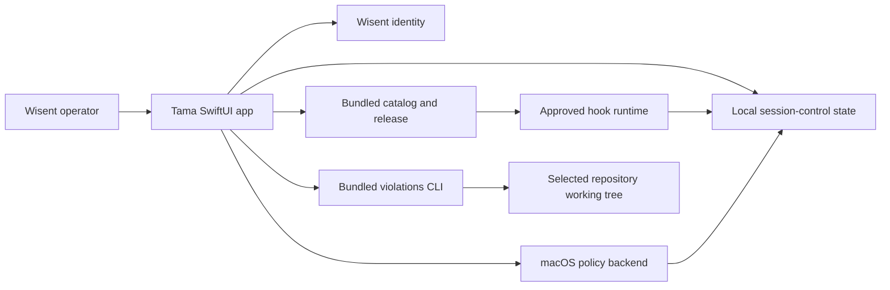

# Tama — local policy control for supervised coding agents

Tama lets a Wisent operator inspect, install, and safely control the approved policy hooks that supervise local coding-agent sessions on macOS.

## Problem and intended users

Coding-agent policy is distributed across agent adapters, Git dispatchers, a privileged macOS policy backend, and a versioned hook catalog. Without a single control surface, an operator cannot reliably answer which policy is loaded, whether enforcement is ready, or how to recover when a hook blocks necessary work.

Tama is for:

- Wisent developers running supported coding agents on their own Mac;
- security or platform operators diagnosing local policy state;
- repository maintainers scanning a working tree for violations of the approved pre-write rules.

Tama is not intended for untrusted multi-user Macs or people without authorization to change the local agent-policy installation.

## Product boundaries

Tama currently includes:

- a read-only view of the integrity-sealed hook catalog bundled with the app;
- inspection of hook purpose, events, side effects, and justification records;
- inspection of live Claude, Codex, OMP, and compatible supervised sessions;
- explicit per-session hook overrides;
- explicit installation of the local session runtime and macOS policy backend;
- an emergency, confirmed disable/re-enable operation for Tama-managed hooks;
- read-only repository violation scans and an explicitly confirmed agent-assisted cleanup workflow.

Explicit non-goals:

- authoring or approving new hooks;
- remote fleet management;
- silently installing policy, credentials, or system services;
- committing or pushing repository changes;
- replacing the Wisent identity service;
- claiming kernel enforcement on unsupported operating systems.

Supported environment: Apple-silicon macOS 14 or newer. The current release does not support Intel Macs, Linux, or Windows. Policy-changing workflows require a current `owner`, `admin`, or `member` role in the selected Wisent organization; unknown or absent roles are denied. Node.js 20 or newer is required when using the bundled hook runtime or repository scan/cleanup workflows. `/usr/bin/python3` is required to install or restore local enforcement. Administrator approval and Full Disk Access are required only for the macOS policy backend.

## Core use cases

### Inspect approved policy

An unauthenticated developer opens Tama with no local policy installation and chooses the read-only inspector. Tama displays the bundled catalog, its checksum and release identity without starting session monitoring, modifying hook configuration, or registering services.

### Prepare local enforcement

An authorized operator reviews the requested filesystem and system permissions, explicitly installs the bundled runtime, then explicitly registers the privileged backend. Success is visible as an installed release identifier and an `Enabled` backend status.

### Control one live session

An operator selects a supervised agent session and a catalog hook, reviews the exact session and effect, and confirms an enable or disable operation. The override is atomic, scoped to that session, and does not alter other sessions.

### Recover from a blocking policy failure

An operator confirms the emergency disable action. Tama pauses supervised sessions, preserves managed configuration, quarantines session overrides, records the emergency state, and bypasses the already-loaded runtime immediately. Re-enable installs the integrity-checked bundled release, restores managed entrypoints transactionally, and keeps emergency state active unless the Brama-backed objective-authority preflight succeeds.

### Find repository policy violations

A maintainer selects a local repository and starts a read-only scan. Tama reports files, rules, skipped inputs, and scanner errors. Agent-assisted cleanup requires separate confirmation and requests working-tree edits only. Tama does not issue commit or push commands, rejects changed HEAD, checked-out branch, or local branch refs, performs a final scan, and requires the operator to inspect Git and remote state because the provider is external.

## How the product works



The signed app bundle and its build manifest identify the product build. The bundled hook release has an independent content digest because hook policy can evolve separately from the desktop app. Authoritative local state lives under `~/Library/Application Support/Tama`; session files and overrides use per-user permissions. The privileged daemon and Network Extension are separate trust boundaries. Wisent identity and repository contents are untrusted external inputs at their respective adapters.

## Quick start

No supported binary has been published yet. The steps below are the contract for the first preview release; source builds are developer-only and are not a substitute for a supported release.

1. From the GitHub release tagged with the exact version, download `Tama-<version>-macOS-arm64.zip`, its `.digest` file, and provenance JSON.
2. Verify the digest before opening the archive:

   ```bash
   shasum -a 256 -c Tama-<version>-macOS-arm64.zip.digest
   ```

   Expected output ends with `OK`.
3. Expand the archive and move `Tama.app` to `~/Applications`.
4. Install the bundled CLI entrypoint with [`examples/getting-started/install-cli.sh`](examples/getting-started/install-cli.sh), then run `tama status`. After provider adapters are configured, `tama status --runtime` additionally checks install drift in the current user's `~/.claude/settings.json` and `~/.codex/hooks.json`; `--home <path>` selects a different explicit home.
5. Open Tama, complete Wisent authentication, then follow **Set up Tama** through runtime installation, privileged backend approval, and matching live-session verification. The full control interface opens only after all setup evidence is satisfied.

Full prerequisites, first-success steps, failure recovery, reset, and uninstall instructions are in [`docs/onboarding.md`](docs/onboarding.md).

## Primary interfaces

- **SwiftUI application:** canonical human interface for inspection, setup, session control, emergency recovery, and violation scans.
- **Tama CLI:** public machine interface for catalog status, hook inspection, provider coverage, Git dispatcher installation, repository scans/cleanup, adaptive recovery, and MCP configuration. Maintainer hook registration additionally requires an explicit writable policy source tree.
- **Session-control JSON protocol:** machine interface between Tama and supported local agent supervisors. Its schema and ownership rules are defined in [`docs/core-contracts.md`](docs/core-contracts.md).
- **Release manifests:** machine-readable build and artifact identity described in [`docs/releases.md`](docs/releases.md).
- **Command examples:** directly runnable shell commands with inline risk and side-effect comments in [`examples/`](examples/).

## Operational model

Tama is local-first. It reads its catalog from the signed application, stores managed runtime state under `~/Library/Application Support/Tama`, and stores installed hook entrypoints only in explicitly documented per-user locations. Credentials remain in the macOS Keychain through Wisent Auth; Tama does not serialize access tokens into its own state or logs.

Installation, state ownership, permissions, observability, recovery, and removal are detailed in [`docs/operations.md`](docs/operations.md). Integration credentials and outage behavior are detailed in [`docs/integrations.md`](docs/integrations.md).

## Project status and support

Status: **development, pre-release (`0.x`)**. No stable or supported binary release is currently published. Until the first preview passes release qualification, the repository is for maintainers and source builds only.

- Canonical release version: the immutable signed Git tag `v<SemVer>` selected by [`Scripts/package-release.sh`](Scripts/package-release.sh)
- Compatibility, releases, upgrade, and rollback: [`docs/releases.md`](docs/releases.md)
- Testing and qualification status: [`docs/testing.md`](docs/testing.md)
- Security reports: [private GitHub Security Advisory](https://github.com/wisent-ai/tama-desktop/security/advisories/new)
- Product issues: [GitHub Issues](https://github.com/wisent-ai/tama-desktop/issues)
- License: Apache License 2.0; see [`LICENSE`](LICENSE)
