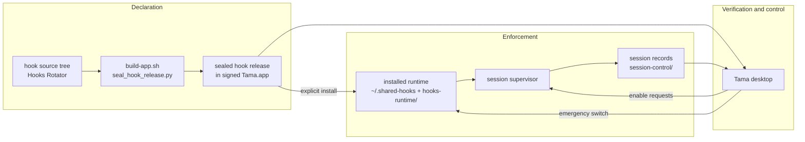

# Architecture

What does Tama own, what does it deliberately not own, and how does a policy
decision travel from a sealed release to a refused tool call? This page is
the structural map; per-noun depth lives in [concepts/](concepts/hook.md)
and the operational contracts in [core-contracts](core-contracts.md).

## The three planes

- **Declaration** happens outside this repository: hook policy is authored
  in the hook source tree, and the build seals it into a content-addressed
  [hook release](concepts/hook-release.md) inside the signed app.
- **Enforcement** happens in the user's home: an explicit install generates
  the runtime, and each supervised session's supervisor executes hooks and
  publishes a record of what it decided.
- **Verification and control** is the desktop plus the sealed CLI: compare
  identities, read decisions, and mutate through exactly two doors —
  [session-scoped enable](concepts/session-enable.md) and
  [global emergency disable](concepts/emergency-disable.md).

## What Tama owns

Everything under `~/Library/Application Support/Tama`
([configuration](configuration.md#state-tama-owns)): installed releases,
the `current` symlink, `installed.json`, the emergency state and backup,
and the session-control directory. Plus the managed per-user entrypoints the
installer generates and records in `installed.json.sourceFiles` — the
installer refuses to delete anything outside those roots
(`Refusing to remove an obsolete path outside managed roots: <path>`).

## What Tama does not own

- **Hook authorship and approval.** The catalog is read-only in the app;
  the bundle is authoritative for it at runtime. Changing policy means
  shipping a new sealed release, never editing an installed one.
- **Session records.** Supervisors write them; Tama only reads. Invalid,
  legacy-v1, or stale records are ignored, and discovery is read-only when
  the directory does not exist ([core-contracts](core-contracts.md#session-discovery)).
- **Credentials.** Wisent authentication lives in the macOS Keychain via
  Wisent Auth; capabilities live only inside supervisor-owned session
  records ([concepts/capability](concepts/capability.md)).
- **Repositories.** The violation scanner is read-only; cleanup edits only a
  selected working tree the operator owns and confirms, and never touches
  `HEAD`, branch refs, commits, or pushes
  ([desktop/violations](desktop/violations.md)).
- **Fleet anything.** One Mac, one home, one operator. Nothing here talks to
  a fleet control plane.

## How data flows

1. **Build time.** `build-app.sh` stages hook sources, compiles the sealed
   Rust `tama-cli`/`tama-mcp-server` from the same tree, renders
   `tama-catalog.json` via `tama-cli list --json`, seals the release
   (digest → `releaseId`), and embeds the seal in `tama-build.json`
   ([scripts](scripts.md#build-and-release-maintainer-only)).
2. **Install time.** `install_hook_release.py` verifies the seal twice,
   rewrites the [registry](concepts/registry.md) for the target home, pins
   Node commands to a validated executable plus version-guard preflight, and
   writes every entrypoint transactionally
   ([hook-releases](hook-releases.md#installation)).
3. **Session time.** An agent launches through `tama-agent` (or a provider
   config routes events to the runtime); the supervisor loads the installed
   registry, executes hooks per event, and publishes its session record —
   identity, hook counts, capability, recent decisions — under
   `session-control/`.
4. **Observation time.** The desktop polls records once per second while
   authorized; the sealed CLI answers the same from `sessions`; the
   loopback backend serves catalog-derived reads
   ([cli](cli.md#the-desktop-backend)).
5. **Control time.** Enables travel as private request files the supervisor
   validates ([concepts/session-enable](concepts/session-enable.md));
   disable is the operator-owned global switch
   ([concepts/emergency-disable](concepts/emergency-disable.md)).

## Trust boundaries

| Boundary | Mechanism |
|---|---|
| Hook tree ↔ everything downstream | Content-addressed [seal](concepts/seal.md), enforced before and after copy |
| App ↔ operator | Wisent role (`owner`/`admin`/`member`) constructs the mutation-capable model; confirmation dialogs and macOS approvals gate each mutation |
| Tama ↔ session | The 64-hex `controlKey` names the session's private request channel; the supervisor validates every envelope and applies overrides itself |
| Session ↔ machine | The privileged daemon (`ai.wisent.tama.system-policy`) and Network Extension (`ai.wisent.tama.network-filter`) enforce kernel-gated process and socket policy; approval-pending is a distinct state, never success |
| Desktop ↔ sealed logic | Catalog reads, install plans, scans, and cleanup go through one loopback child (`tama-cli serve --port 0 --root <release>`) on `127.0.0.1` — the binary the app runs is the one the build sealed |
| Runtime ↔ Node.js | The installer canonicalizes and pins one Node ≥ 20 executable into every Node-based command with a preflight guard; the generated launcher fails closed (exit 66) when either moves |

## Failure posture

Fail closed, roll back, keep evidence. The installer is transactional with
explicit rollback of files, symlink, and OMP registration; the emergency
switch records its manifest before relying on it and re-reads durable state
after acting; session mutations report rejection, timeout, and session exit
as failures rather than assuming success; and every refusal is one sentence
that exists in a source file — the [runbook](runbook.md) indexes them.
